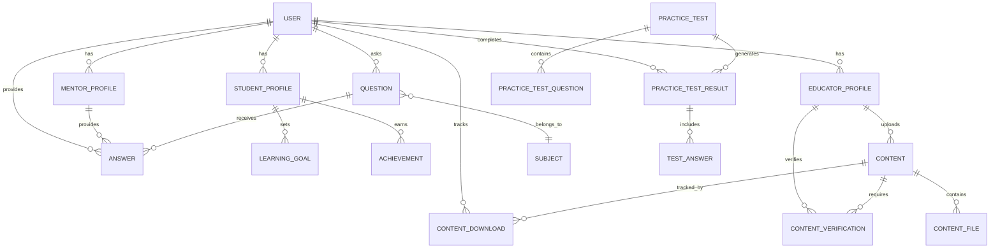
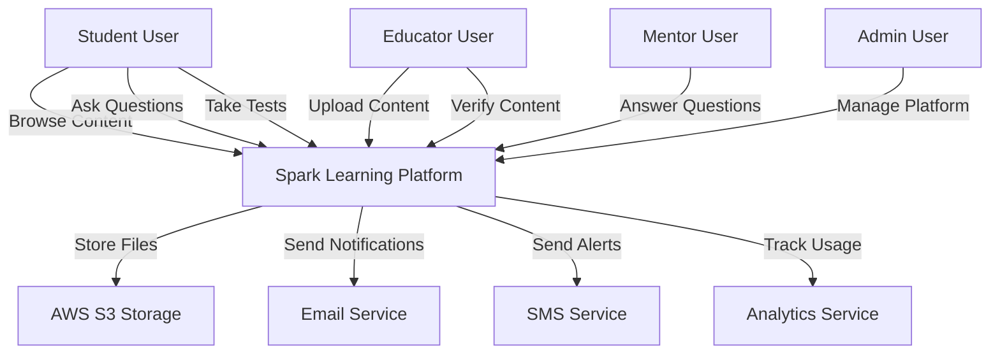
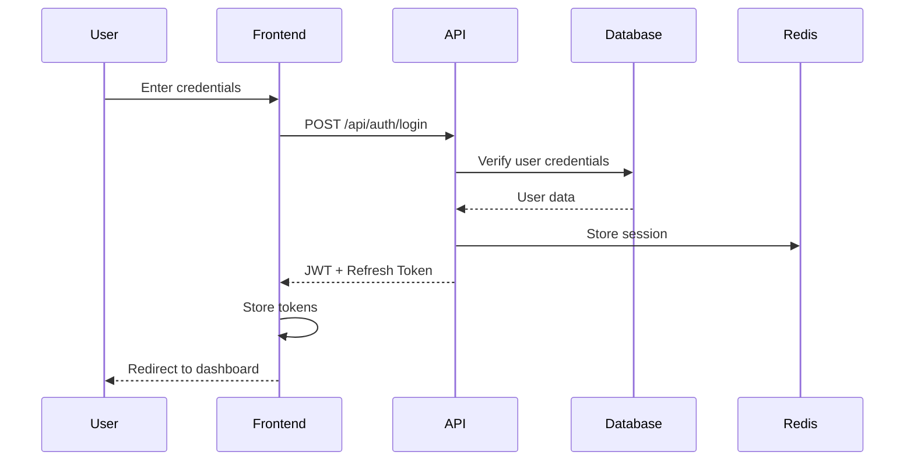
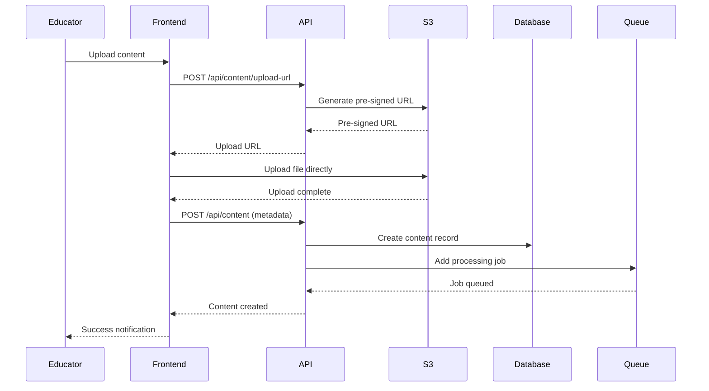
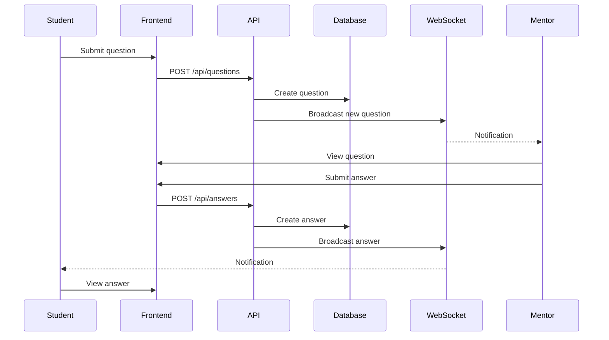
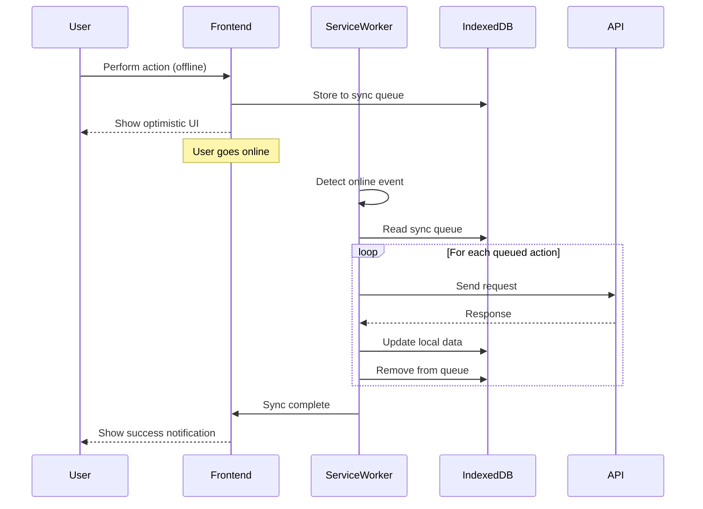
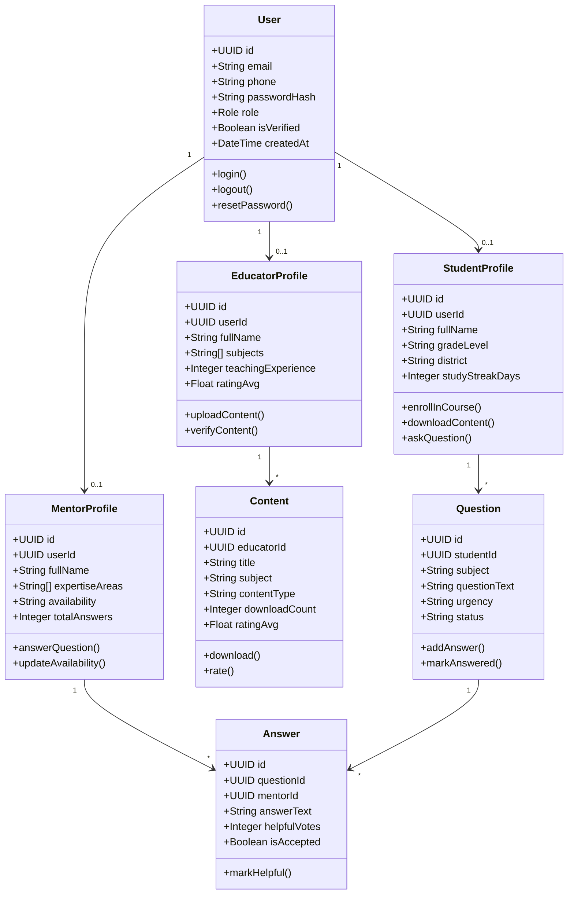
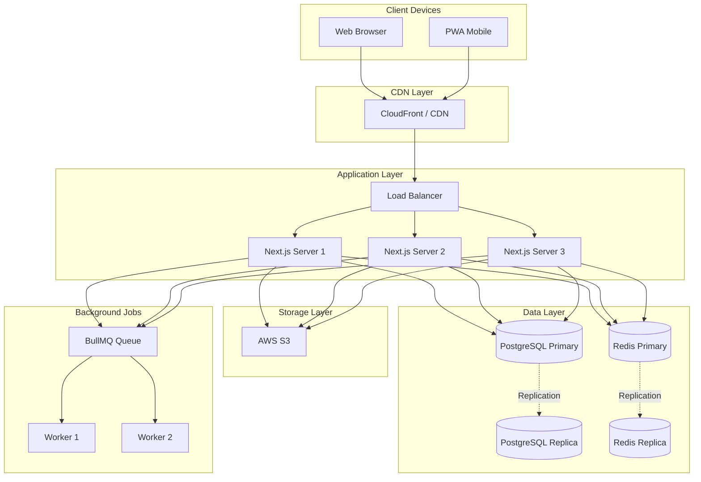

# Backend Implementation Plan
**Spark Learning Platform**  
**Last Updated:** January 29, 2024  
**Version:** 1.0

---

## Table of Contents
1. [Executive Summary](#executive-summary)
2. [System Architecture](#system-architecture)
3. [Technology Stack](#technology-stack)
4. [Database Design](#database-design)
5. [API Design](#api-design)
6. [Authentication & Authorization](#authentication--authorization)
7. [Offline-First Implementation](#offline-first-implementation)
8. [File Storage System](#file-storage-system)
9. [Real-Time Features](#real-time-features)
10. [UML Diagrams](#uml-diagrams)
11. [Implementation Roadmap](#implementation-roadmap)

---

## Executive Summary

This document outlines the complete backend implementation plan for the Spark Learning Platform. The current frontend (UI) is complete with mock data. This plan details how to build a production-ready backend that integrates with the existing UI.

**Key Requirements:**
- Offline-first architecture
- Low bandwidth optimization
- Mobile-first performance
- Role-based access control (Student, Educator, Mentor, Admin)
- Real-time notifications
- Content management and delivery
- Question/answer system
- Practice test management

---

## System Architecture

### High-Level Architecture

```
┌─────────────────────────────────────────────────────────────┐
│                       Client Layer                          │
│  (Next.js 14 App Router + React + TypeScript)              │
│                                                             │
│  ┌──────────────┐  ┌──────────────┐  ┌──────────────┐    │
│  │   Browser    │  │     PWA      │  │  Mobile App  │    │
│  │   Client     │  │   Service    │  │   (Future)   │    │
│  │              │  │   Worker     │  │              │    │
│  └──────────────┘  └──────────────┘  └──────────────┘    │
│          │                 │                  │            │
│          └─────────────────┴──────────────────┘            │
│                         │                                   │
└─────────────────────────┼───────────────────────────────────┘
                          │
                    [HTTPS/WSS]
                          │
┌─────────────────────────┼───────────────────────────────────┐
│                         │                                   │
│              ┌──────────▼──────────┐                        │
│              │   API Gateway       │                        │
│              │  (Next.js Routes)   │                        │
│              └──────────┬──────────┘                        │
│                         │                                   │
│         ┌───────────────┼───────────────┐                   │
│         │               │               │                   │
│    ┌────▼────┐    ┌────▼────┐    ┌────▼────┐              │
│    │  Auth   │    │   API   │    │ WebSocket│              │
│    │ Service │    │ Service │    │ Service  │              │
│    └────┬────┘    └────┬────┘    └────┬────┘              │
│         │              │              │                     │
│         └──────────────┼──────────────┘                     │
│                        │                                    │
│           ┌────────────┼────────────┐                       │
│           │            │            │                       │
│      ┌────▼────┐  ┌───▼────┐  ┌───▼────┐                  │
│      │Database │  │ Redis  │  │  File  │                  │
│      │(Postgres│  │ Cache  │  │Storage │                  │
│      │   SQL)  │  │        │  │  (S3)  │                  │
│      └─────────┘  └────────┘  └────────┘                  │
│                                                             │
│                  Backend Infrastructure                     │
└─────────────────────────────────────────────────────────────┘
```

### Component Breakdown

**Frontend (Already Built)**
- Next.js 14 with App Router
- React components with TypeScript
- Tailwind CSS for styling
- shadcn/ui component library
- React Hook Form + Zod for validation

**Backend (To Be Built)**
- **API Layer**: Next.js API Routes (or separate Express/Fastify server)
- **Database**: PostgreSQL for relational data
- **Cache**: Redis for session management and caching
- **Storage**: AWS S3 or similar for files/media
- **WebSocket**: Socket.io for real-time features
- **Queue**: Bull/BullMQ for background jobs

---

## Technology Stack

### Recommended Stack

| Layer | Technology | Justification |
|-------|-----------|---------------|
| **API Framework** | Next.js API Routes | Already using Next.js, unified codebase |
| **Database** | PostgreSQL 15+ | Robust, reliable, JSON support, full-text search |
| **ORM** | Prisma | Type-safe, migrations, great DX with TypeScript |
| **Cache** | Redis | Fast session storage, rate limiting |
| **File Storage** | AWS S3 / MinIO | Scalable, CDN-ready, cost-effective |
| **Search** | PostgreSQL Full-Text | Native search, good enough for MVP |
| **WebSocket** | Socket.io | Real-time notifications, wide browser support |
| **Authentication** | NextAuth.js | OAuth support, session management |
| **Background Jobs** | BullMQ | Redis-based queue, reliable job processing |
| **Validation** | Zod | Already using on frontend, consistent validation |

### Alternative Stack (If scaling independently)

| Layer | Technology | Use Case |
|-------|-----------|----------|
| **API Framework** | Express.js / Fastify | Separate API server for microservices |
| **Auth** | JWT + Passport.js | Stateless auth for mobile apps |
| **Search** | Elasticsearch | Advanced search requirements |
| **Storage** | MinIO (self-hosted) | Cost savings for MVP |

---

## Database Design

### Entity Relationship Diagram (ERD)



### Core Tables

#### 1. **users**
```sql
CREATE TABLE users (
  id UUID PRIMARY KEY DEFAULT gen_random_uuid(),
  email VARCHAR(255) UNIQUE NOT NULL,
  phone VARCHAR(20) UNIQUE,
  password_hash VARCHAR(255) NOT NULL,
  role VARCHAR(20) NOT NULL CHECK (role IN ('student', 'educator', 'mentor', 'admin')),
  is_verified BOOLEAN DEFAULT FALSE,
  is_active BOOLEAN DEFAULT TRUE,
  language_preference VARCHAR(10) DEFAULT 'en',
  created_at TIMESTAMP DEFAULT NOW(),
  updated_at TIMESTAMP DEFAULT NOW(),
  last_login_at TIMESTAMP
);

CREATE INDEX idx_users_email ON users(email);
CREATE INDEX idx_users_role ON users(role);
```

#### 2. **student_profiles**
```sql
CREATE TABLE student_profiles (
  id UUID PRIMARY KEY DEFAULT gen_random_uuid(),
  user_id UUID REFERENCES users(id) ON DELETE CASCADE,
  full_name VARCHAR(255) NOT NULL,
  grade_level VARCHAR(50) NOT NULL,
  district VARCHAR(100),
  school VARCHAR(255),
  date_of_birth DATE,
  avatar_url TEXT,
  study_streak_days INTEGER DEFAULT 0,
  last_streak_date DATE,
  created_at TIMESTAMP DEFAULT NOW(),
  updated_at TIMESTAMP DEFAULT NOW(),
  UNIQUE(user_id)
);

CREATE INDEX idx_student_profiles_user_id ON student_profiles(user_id);
```

#### 3. **educator_profiles**
```sql
CREATE TABLE educator_profiles (
  id UUID PRIMARY KEY DEFAULT gen_random_uuid(),
  user_id UUID REFERENCES users(id) ON DELETE CASCADE,
  full_name VARCHAR(255) NOT NULL,
  qualification VARCHAR(100) NOT NULL,
  subjects TEXT[] NOT NULL,
  teaching_experience INTEGER,
  institution VARCHAR(255),
  avatar_url TEXT,
  is_verified BOOLEAN DEFAULT FALSE,
  verification_date TIMESTAMP,
  rating_avg NUMERIC(3,2) DEFAULT 0.00,
  rating_count INTEGER DEFAULT 0,
  created_at TIMESTAMP DEFAULT NOW(),
  updated_at TIMESTAMP DEFAULT NOW(),
  UNIQUE(user_id)
);

CREATE INDEX idx_educator_profiles_user_id ON educator_profiles(user_id);
CREATE INDEX idx_educator_profiles_subjects ON educator_profiles USING GIN(subjects);
```

#### 4. **mentor_profiles**
```sql
CREATE TABLE mentor_profiles (
  id UUID PRIMARY KEY DEFAULT gen_random_uuid(),
  user_id UUID REFERENCES users(id) ON DELETE CASCADE,
  full_name VARCHAR(255) NOT NULL,
  expertise_areas TEXT[] NOT NULL,
  availability VARCHAR(20) NOT NULL,
  background TEXT,
  avatar_url TEXT,
  is_verified BOOLEAN DEFAULT FALSE,
  helpful_rating_avg NUMERIC(3,2) DEFAULT 0.00,
  helpful_rating_count INTEGER DEFAULT 0,
  total_answers INTEGER DEFAULT 0,
  created_at TIMESTAMP DEFAULT NOW(),
  updated_at TIMESTAMP DEFAULT NOW(),
  UNIQUE(user_id)
);

CREATE INDEX idx_mentor_profiles_user_id ON mentor_profiles(user_id);
CREATE INDEX idx_mentor_profiles_expertise ON mentor_profiles USING GIN(expertise_areas);
```

#### 5. **content**
```sql
CREATE TABLE content (
  id UUID PRIMARY KEY DEFAULT gen_random_uuid(),
  educator_id UUID REFERENCES educator_profiles(id) ON DELETE SET NULL,
  title VARCHAR(255) NOT NULL,
  description TEXT,
  subject VARCHAR(100) NOT NULL,
  grade_level VARCHAR(50) NOT NULL,
  content_type VARCHAR(50) NOT NULL CHECK (content_type IN ('pdf', 'video', 'audio', 'text', 'interactive')),
  topic VARCHAR(255),
  duration_minutes INTEGER,
  file_size_bytes BIGINT,
  thumbnail_url TEXT,
  is_verified BOOLEAN DEFAULT FALSE,
  is_published BOOLEAN DEFAULT FALSE,
  verification_status VARCHAR(20) DEFAULT 'pending' CHECK (verification_status IN ('pending', 'approved', 'rejected')),
  download_count INTEGER DEFAULT 0,
  rating_avg NUMERIC(3,2) DEFAULT 0.00,
  rating_count INTEGER DEFAULT 0,
  created_at TIMESTAMP DEFAULT NOW(),
  updated_at TIMESTAMP DEFAULT NOW()
);

CREATE INDEX idx_content_subject ON content(subject);
CREATE INDEX idx_content_grade_level ON content(grade_level);
CREATE INDEX idx_content_type ON content(content_type);
CREATE INDEX idx_content_verified ON content(is_verified, is_published);
CREATE INDEX idx_content_educator_id ON content(educator_id);
```

#### 6. **content_files**
```sql
CREATE TABLE content_files (
  id UUID PRIMARY KEY DEFAULT gen_random_uuid(),
  content_id UUID REFERENCES content(id) ON DELETE CASCADE,
  file_url TEXT NOT NULL,
  file_type VARCHAR(50) NOT NULL,
  file_size_bytes BIGINT NOT NULL,
  file_name VARCHAR(255) NOT NULL,
  s3_key TEXT,
  created_at TIMESTAMP DEFAULT NOW()
);

CREATE INDEX idx_content_files_content_id ON content_files(content_id);
```

#### 7. **questions**
```sql
CREATE TABLE questions (
  id UUID PRIMARY KEY DEFAULT gen_random_uuid(),
  student_id UUID REFERENCES student_profiles(id) ON DELETE CASCADE,
  subject VARCHAR(100) NOT NULL,
  grade_level VARCHAR(50) NOT NULL,
  title VARCHAR(255) NOT NULL,
  question_text TEXT NOT NULL,
  urgency VARCHAR(20) DEFAULT 'medium' CHECK (urgency IN ('low', 'medium', 'high')),
  image_url TEXT,
  status VARCHAR(20) DEFAULT 'open' CHECK (status IN ('open', 'answered', 'closed')),
  answer_count INTEGER DEFAULT 0,
  created_at TIMESTAMP DEFAULT NOW(),
  updated_at TIMESTAMP DEFAULT NOW()
);

CREATE INDEX idx_questions_student_id ON questions(student_id);
CREATE INDEX idx_questions_subject ON questions(subject);
CREATE INDEX idx_questions_status ON questions(status);
CREATE INDEX idx_questions_urgency ON questions(urgency);
```

#### 8. **answers**
```sql
CREATE TABLE answers (
  id UUID PRIMARY KEY DEFAULT gen_random_uuid(),
  question_id UUID REFERENCES questions(id) ON DELETE CASCADE,
  mentor_id UUID REFERENCES mentor_profiles(id) ON DELETE SET NULL,
  answer_text TEXT NOT NULL,
  helpful_votes INTEGER DEFAULT 0,
  is_accepted BOOLEAN DEFAULT FALSE,
  created_at TIMESTAMP DEFAULT NOW(),
  updated_at TIMESTAMP DEFAULT NOW()
);

CREATE INDEX idx_answers_question_id ON answers(question_id);
CREATE INDEX idx_answers_mentor_id ON answers(mentor_id);
```

#### 9. **practice_tests**
```sql
CREATE TABLE practice_tests (
  id UUID PRIMARY KEY DEFAULT gen_random_uuid(),
  title VARCHAR(255) NOT NULL,
  subject VARCHAR(100) NOT NULL,
  grade_level VARCHAR(50) NOT NULL,
  duration_minutes INTEGER NOT NULL,
  total_questions INTEGER NOT NULL,
  pass_score_percentage INTEGER DEFAULT 60,
  is_published BOOLEAN DEFAULT FALSE,
  created_at TIMESTAMP DEFAULT NOW(),
  updated_at TIMESTAMP DEFAULT NOW()
);

CREATE INDEX idx_practice_tests_subject ON practice_tests(subject);
CREATE INDEX idx_practice_tests_grade_level ON practice_tests(grade_level);
```

#### 10. **practice_test_results**
```sql
CREATE TABLE practice_test_results (
  id UUID PRIMARY KEY DEFAULT gen_random_uuid(),
  student_id UUID REFERENCES student_profiles(id) ON DELETE CASCADE,
  practice_test_id UUID REFERENCES practice_tests(id) ON DELETE CASCADE,
  score_percentage NUMERIC(5,2) NOT NULL,
  time_taken_seconds INTEGER NOT NULL,
  completed_at TIMESTAMP DEFAULT NOW()
);

CREATE INDEX idx_practice_test_results_student_id ON practice_test_results(student_id);
CREATE INDEX idx_practice_test_results_test_id ON practice_test_results(practice_test_id);
```

---

## API Design

### REST API Endpoints

#### **Authentication**
```
POST   /api/auth/register          - Register new user
POST   /api/auth/login             - Login user
POST   /api/auth/logout            - Logout user
POST   /api/auth/refresh           - Refresh auth token
POST   /api/auth/reset-password    - Request password reset
POST   /api/auth/verify-code       - Verify reset code
POST   /api/auth/update-password   - Update password
GET    /api/auth/me                - Get current user
```

#### **Users**
```
GET    /api/users/:id              - Get user profile
PATCH  /api/users/:id              - Update user profile
DELETE /api/users/:id              - Delete user (soft delete)
```

#### **Content**
```
GET    /api/content                - List content (with filters)
GET    /api/content/:id            - Get content details
POST   /api/content                - Upload content (educator)
PATCH  /api/content/:id            - Update content (educator)
DELETE /api/content/:id            - Delete content (educator)
POST   /api/content/:id/download   - Track download
POST   /api/content/:id/rate       - Rate content
GET    /api/content/:id/file       - Download content file
```

#### **Questions**
```
GET    /api/questions              - List questions (with filters)
GET    /api/questions/:id          - Get question details
POST   /api/questions              - Create question (student)
PATCH  /api/questions/:id          - Update question (student)
DELETE /api/questions/:id          - Delete question (student)
POST   /api/questions/:id/answer   - Answer question (mentor)
POST   /api/answers/:id/helpful    - Mark answer helpful
POST   /api/answers/:id/accept     - Accept answer (student)
```

#### **Practice Tests**
```
GET    /api/practice-tests         - List practice tests
GET    /api/practice-tests/:id     - Get test details
POST   /api/practice-tests/:id/start - Start test attempt
POST   /api/practice-tests/:id/submit - Submit test results
GET    /api/practice-tests/:id/results/:resultId - Get results
```

#### **Dashboard**
```
GET    /api/dashboard/student      - Get student dashboard data
GET    /api/dashboard/educator     - Get educator dashboard data
GET    /api/dashboard/mentor       - Get mentor dashboard data
```

### API Response Format

**Success Response:**
```json
{
  "success": true,
  "data": {
    // Response data
  },
  "meta": {
    "page": 1,
    "limit": 20,
    "total": 100
  }
}
```

**Error Response:**
```json
{
  "success": false,
  "error": {
    "code": "VALIDATION_ERROR",
    "message": "Invalid input data",
    "details": [
      {
        "field": "email",
        "message": "Invalid email format"
      }
    ]
  }
}
```

---

## Authentication & Authorization

### Strategy: JWT + Refresh Tokens

```typescript
// JWT Payload Structure
interface JWTPayload {
  userId: string;
  role: 'student' | 'educator' | 'mentor' | 'admin';
  email: string;
  iat: number;  // Issued at
  exp: number;  // Expiry
}

// Access Token: 15 minutes
// Refresh Token: 7 days (stored in httpOnly cookie)
```

### Role-Based Access Control (RBAC)

| Endpoint | Student | Educator | Mentor | Admin |
|----------|---------|----------|--------|-------|
| Upload Content | ❌ | ✅ | ❌ | ✅ |
| Verify Content | ❌ | ✅ | ❌ | ✅ |
| Ask Question | ✅ | ✅ | ✅ | ✅ |
| Answer Question | ❌ | ❌ | ✅ | ✅ |
| Download Content | ✅ | ✅ | ✅ | ✅ |
| Take Practice Test | ✅ | ❌ | ❌ | ✅ |
| View Analytics | ❌ | ✅ (own) | ✅ (own) | ✅ (all) |

### Middleware Stack
```typescript
// API Route Protection
export default async function handler(req, res) {
  // 1. Parse JWT from Authorization header
  // 2. Verify token signature
  // 3. Check token expiration
  // 4. Load user from database
  // 5. Check user role permissions
  // 6. Proceed to route handler
}
```

---

## Offline-First Implementation

### Architecture

```
┌─────────────────────────────────────────────────────────────┐
│                      Browser Client                         │
│                                                             │
│  ┌──────────────┐    ┌──────────────┐    ┌──────────────┐ │
│  │    React     │◄──►│   Service    │◄──►│  IndexedDB   │ │
│  │  Components  │    │    Worker    │    │   Storage    │ │
│  └──────────────┘    └──────────────┘    └──────────────┘ │
│         │                    │                             │
│         └────────────────────┼─────────────────────────────┘
│                              │
│                      [Network Request]
│                              │
│                              ▼
│           ┌─────────────────────────────────┐
│           │  Cache-First / Network-First    │
│           │  Strategy (Workbox)             │
│           └─────────────────────────────────┘
```

### IndexedDB Schema

```typescript
// Store: users
{
  keyPath: 'id',
  data: {
    id: string,
    profile: UserProfile,
    cachedAt: timestamp
  }
}

// Store: content
{
  keyPath: 'id',
  indices: ['subject', 'gradeLevel'],
  data: {
    id: string,
    metadata: ContentMetadata,
    file: Blob | null,
    downloaded: boolean,
    cachedAt: timestamp
  }
}

// Store: syncQueue
{
  keyPath: 'id',
  autoIncrement: true,
  data: {
    id: number,
    action: 'CREATE' | 'UPDATE' | 'DELETE',
    resource: string,
    payload: any,
    createdAt: timestamp,
    retryCount: number
  }
}
```

### Sync Strategy

**On User Action (Offline):**
1. Add action to sync queue
2. Update local state immediately (optimistic UI)
3. Show "Syncing..." indicator
4. Mark item as pending sync

**On Reconnection:**
1. Detect online event
2. Process sync queue in order
3. Send requests to backend
4. Update local state with server response
5. Remove from sync queue on success
6. Show sync complete notification

---

## File Storage System

### Storage Architecture

```
User Uploads ──► API Server ──► S3 Bucket
                     │
                     ├──► Virus Scan
                     ├──► File Validation
                     ├──► Thumbnail Generation
                     └──► Database Record
```

### S3 Bucket Structure

```
spark-learning-content/
├── uploads/
│   ├── {educator_id}/
│   │   ├── {content_id}/
│   │   │   ├── original.pdf
│   │   │   ├── thumbnail.jpg
│   │   │   └── compressed.pdf
├── avatars/
│   ├── {user_id}.jpg
└── temp/
    └── {upload_id}/
```

### Upload Flow

1. **Client initiates upload**
   - POST /api/content/upload-url
   - Server generates pre-signed S3 URL

2. **Direct upload to S3**
   - Client uploads directly to S3 (reduces server load)

3. **S3 webhook notification**
   - Server processes uploaded file
   - Virus scan, validation
   - Generate thumbnails
   - Create database record

4. **Publish content**
   - Educator marks as ready
   - Other educators verify
   - Admin approves

---

## Real-Time Features

### WebSocket Events

```typescript
// Server → Client
'notification:new' → { type, message, data }
'question:answered' → { questionId, answerId }
'content:verified' → { contentId, status }
'sync:status' → { syncing: boolean, progress }

// Client → Server
'question:subscribe' → { questionId }
'question:unsubscribe' → { questionId }
'presence:update' → { status: 'online' | 'away' }
```

### Notification Types

| Event | Recipients | Priority |
|-------|-----------|----------|
| Question Answered | Student (question owner) | High |
| Content Verified | Educator (content owner) | Medium |
| New Badge Earned | Student | Low |
| Mentor Assignment | Mentor | High |
| System Announcement | All | Medium |

---

## UML Diagrams

### 1. System Context Diagram



### 2. User Authentication Flow



### 3. Content Upload Flow



### 4. Question/Answer Flow



### 5. Offline Sync Flow



### 6. Class Diagram (Core Models)



### 7. Deployment Diagram



---

## Implementation Roadmap

### Phase 1: Foundation (Weeks 1-2)
**Goal:** Set up infrastructure and basic authentication

- [ ] Set up PostgreSQL database
- [ ] Configure Prisma ORM
- [ ] Create database schema and migrations
- [ ] Implement user authentication (JWT)
- [ ] Build login/logout endpoints
- [ ] Build signup endpoints (3 roles)
- [ ] Implement password reset flow
- [ ] Set up Redis for sessions
- [ ] Configure CORS and security headers

**Deliverable:** Users can register, login, and reset passwords

---

### Phase 2: Core Features (Weeks 3-4)
**Goal:** Enable content management and browsing

- [ ] Build content upload system
- [ ] Integrate S3 for file storage
- [ ] Create content listing API
- [ ] Implement search and filters
- [ ] Build download tracking
- [ ] Create rating system
- [ ] Build educator dashboard API
- [ ] Implement content verification workflow
- [ ] Add background job processing

**Deliverable:** Educators can upload content, students can browse and download

---

### Phase 3: Question/Answer System (Weeks 5-6)
**Goal:** Enable mentor-student interaction

- [ ] Build question submission API
- [ ] Create question listing with filters
- [ ] Implement answer posting
- [ ] Add helpful voting system
- [ ] Build mentor dashboard API
- [ ] Implement question assignment logic
- [ ] Add email notifications
- [ ] Create question status management

**Deliverable:** Students can ask questions, mentors can answer

---

### Phase 4: Practice Tests (Week 7)
**Goal:** Enable self-assessment

- [ ] Build practice test creation (admin)
- [ ] Create test listing API
- [ ] Implement test taking flow
- [ ] Build test submission and grading
- [ ] Create results API
- [ ] Add test analytics
- [ ] Build student performance tracking

**Deliverable:** Students can take practice tests and view results

---

### Phase 5: Real-Time Features (Week 8)
**Goal:** Add live notifications

- [ ] Integrate Socket.io
- [ ] Implement WebSocket authentication
- [ ] Build notification system
- [ ] Create real-time question updates
- [ ] Add online presence indicators
- [ ] Implement push notifications

**Deliverable:** Users receive real-time updates

---

### Phase 6: Offline-First PWA (Weeks 9-10)
**Goal:** Enable offline functionality

- [ ] Configure service worker
- [ ] Implement cache strategies (Workbox)
- [ ] Build IndexedDB storage layer
- [ ] Create sync queue system
- [ ] Implement background sync
- [ ] Add offline detection
- [ ] Build sync UI indicators
- [ ] Test offline scenarios

**Deliverable:** App works fully offline with sync on reconnection

---

### Phase 7: Admin Dashboard (Week 11)
**Goal:** Platform management

- [ ] Build admin dashboard API
- [ ] Create user management endpoints
- [ ] Implement content moderation
- [ ] Add analytics and reporting
- [ ] Build system settings management
- [ ] Create audit logs
- [ ] Implement role management

**Deliverable:** Admins can manage the platform

---

### Phase 8: Optimization & Testing (Week 12)
**Goal:** Production readiness

- [ ] Performance optimization
- [ ] Database query optimization
- [ ] Implement API rate limiting
- [ ] Add monitoring (Sentry, DataDog)
- [ ] Write API tests
- [ ] Load testing
- [ ] Security audit
- [ ] Documentation

**Deliverable:** Production-ready system

---

## Development Guidelines

### Code Structure
```
src/
├── app/                    # Next.js app directory (already exists)
├── lib/
│   ├── db/
│   │   ├── prisma.ts       # Prisma client
│   │   └── migrations/     # Database migrations
│   ├── auth/
│   │   ├── jwt.ts          # JWT utilities
│   │   ├── middleware.ts   # Auth middleware
│   │   └── password.ts     # Password hashing
│   ├── storage/
│   │   ├── s3.ts           # S3 utilities
│   │   └── upload.ts       # File upload logic
│   ├── cache/
│   │   └── redis.ts        # Redis client
│   └── utils/
│       ├── validation.ts   # Zod schemas
│       └── errors.ts       # Error handlers
├── services/
│   ├── user.service.ts
│   ├── content.service.ts
│   ├── question.service.ts
│   └── test.service.ts
└── workers/
    ├── sync.worker.ts
    └── notification.worker.ts
```

### API Standards
- Use RESTful conventions
- Validate all inputs with Zod
- Return consistent response format
- Handle errors gracefully
- Log all requests
- Rate limit endpoints
- Use proper HTTP status codes

### Security Checklist
- [ ] Validate all user inputs
- [ ] Sanitize file uploads
- [ ] Implement CSRF protection
- [ ] Use parameterized queries (Prisma)
- [ ] Hash passwords with bcrypt
- [ ] Implement rate limiting
- [ ] Use HTTPS only
- [ ] Set secure headers
- [ ] Implement proper CORS
- [ ] Store secrets in environment variables

---

## Testing Strategy

### Unit Tests
- Test individual service functions
- Mock database calls
- Test validation schemas
- Test utility functions

### Integration Tests
- Test API endpoints
- Test authentication flow
- Test database operations
- Test file uploads

### E2E Tests
- Test complete user flows
- Test offline scenarios
- Test sync functionality
- Test real-time features

---

## Monitoring & Logging

### Key Metrics
- API response times
- Database query performance
- Error rates
- Active users
- Content downloads
- Question response times
- Sync queue length

### Logging
```typescript
// Structured logging with Winston/Pino
logger.info('User logged in', {
  userId: user.id,
  role: user.role,
  timestamp: new Date().toISOString()
});

logger.error('Content upload failed', {
  userId: user.id,
  contentId: content.id,
  error: error.message,
  stack: error.stack
});
```

---

## Conclusion

This plan provides a complete roadmap for implementing the backend for the Spark Learning Platform. The frontend UI is complete and ready for integration. Following this plan will result in a production-ready, offline-first educational platform.

**Next Steps:**
1. Review and approve this plan
2. Set up development environment
3. Begin Phase 1 implementation
4. Schedule regular reviews

**Estimated Timeline:** 12 weeks for full backend implementation

**Team Requirements:**
- 1-2 Backend Developers
- 1 DevOps Engineer
- 1 QA Engineer

---

**Document Version:** 1.0  
**Last Updated:** January 29, 2024  
**Maintained By:** Development Team
